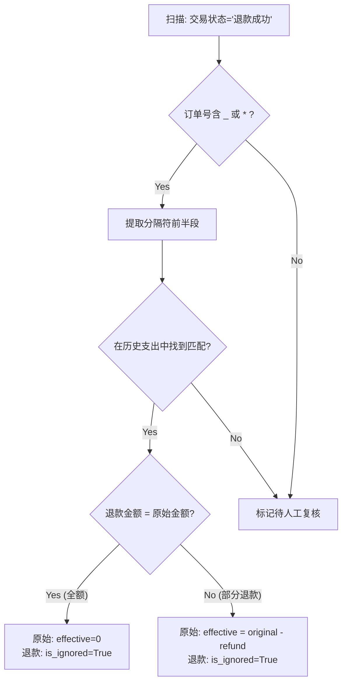
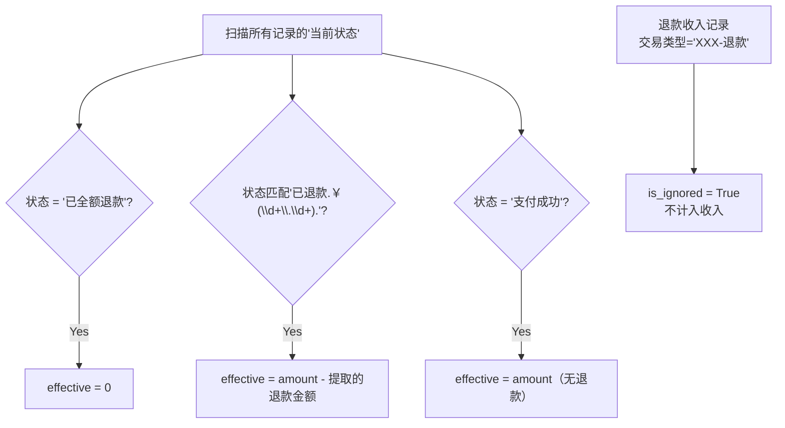

# 跨平台支付记账分析工具实施方案（V3 - 基于真实数据验证）

---

## V3 相对 V2 的核心变化

| 变化点 | 说明 |
|---|---|
| **微信是 XLSX** | 按季度分 4 个文件，不是 CSV |
| **支付宝是 GB2312** | 不是 UTF-8 |
| **多用户** | `Parko` = `赵锡盛`，未来支持多人 |
| **LLM 打标** | 微信无消费分类，需 LLM 逐条打标 |
| **退款算法** | 每个平台一套独立逻辑，基于真实数据验证 |

---

## 真实数据结构

### 支付宝 CSV

- 编码 GB2312，前 24 行元数据，第 25 行表头
- **2009 笔**（支出 1251 / 收入 17 / 不计收支 741）
- **有 24 个预设分类**（可直接映射）

| 列 | 示例 |
|---|---|
| 交易时间 | `2025-12-31 21:39:48` |
| 交易分类 | `日用百货` ✅ |
| 交易对方 | `HitGoo 嗨特购` |
| 商品说明 | `停车费用-京-AB53259` |
| 收/支 | `支出`/`收入`/`不计收支` |
| 金额 | `4.50` |
| 收/付款方式 | `中信银行信用卡(6463)` |
| 交易状态 | `交易成功`/`退款成功`/`交易关闭` |
| 交易订单号 | `2025123122001412181426946964` |
| 商家订单号 | `20251231213951840355` |

### 微信 XLSX

- 4 季度文件，前 16 行元数据，第 17 行表头
- 约 **420 笔**
- **无消费分类**，只有交易类型

| 列 | 示例 |
|---|---|
| 交易时间 | `2025-03-31 12:55:24` |
| **交易类型** | `商户消费` ⚠️ 非消费分类 |
| 交易对方 | `麦当劳` |
| 商品 | `麦当劳`/`收款方备注:二维码收款` |
| 收/支 | `支出`/`收入`/`/`(中性) |
| 金额(元) | `¥36.90` ← **带 ¥ 前缀** |
| 支付方式 | `工商银行信用卡(2125)` |
| 当前状态 | `支付成功`/`已全额退款`/`已退款(￥14.00)` |
| 交易单号 | `4200002645...` |
| 商户单号 | `12826801...` |
| 备注 | `已优惠¥5.00` / `/` |

---

## 退款对冲算法（每平台独立）

### 支付宝退款：订单号拆分法

基于 41 笔真实退款验证，**38/41（93%）可通过订单号精确匹配**。

**机制**：退款记录的 `交易订单号` 用 `_` 或 `*` 拼接原始订单号：
```
2025122922001412181413275635_5220180330024764010461368606
│─── 原始交易订单号 ───│  │─── 退款后缀 ───│
```

**算法流程**：



**真实数据验证结果**：

| 类型 | 数量 | 原始状态 | 处理方式 |
|---|---|---|---|
| 全额退款 | 29 | `交易关闭` | effective = 0 |
| 部分退款 | 9 | `交易成功` | effective = original − refund |
| 未匹配 | 3 | — | 跨年/保险退款，标记人工复核 |

> [!TIP]
> 支付宝的辅助信号：原始记录状态为 `交易关闭` = 全额退款，`交易成功` = 部分退款。可用于交叉校验。

---

### 微信退款：状态自描述法

微信退款**不需要反向查找退款记录**，因为原始支出的`当前状态`字段直接标注了退款金额。



**真实数据示例**：

| 原始记录 | 退款记录 | 关联方式 |
|---|---|---|
| 麦当劳 ¥33.90 状态=`已退款(￥14.00)` | ¥14.00 类型=`北京麦当劳-退款` | 原始状态自带退款额 |
| 途虎养车 ¥35.90 状态=`已全额退款` | ¥35.90 类型=`途虎养车-退款` | 原始状态 = 全额 |
| 红包 ¥50 商户单号=`100003990...298` | ¥50 交易单号=`100003990...298` | 商户单号 = 退款交易单号 |

> [!IMPORTANT]
> **核心发现**：微信的退款处理比预想的简单得多。不需要启发式匹配——直接读原始记录的状态即可。

---

## 非消费项过滤 → 双轨分流

### 支付宝分流规则

支付宝自带 `收/支` 三态分类，配合 `交易分类` 可精准过滤：

| 条件 | 轨道 | 说明 |
|---|---|---|
| 收/支 = `不计收支` | cashflow | 741 笔（投资理财、退款、交易关闭等） |
| 交易分类 = `转账红包` | cashflow | 小荷包自动攒、转账等 |
| 交易分类 = `投资理财` | cashflow | 余额宝、基金买入等 |
| 交易分类 = `信用借还` | cashflow | 花呗/信用卡还款 |
| 交易分类 = `退款` | refund 处理 | 走退款对冲算法 |
| 交易分类 = `收入` | cashflow | 闲鱼等收款 |
| 其余（支出 + 消费分类） | **consumption** | 真实消费 |

### 微信分流规则

微信用 `交易类型` 做硬分流：

| 交易类型 | 轨道 |
|---|---|
| `商户消费` | consumption → LLM 打标 |
| `扫二维码付款` + 状态=`已转账` | cashflow（向个人转账） |
| `扫二维码付款` + 状态=`支付成功` | consumption → LLM 打标 |
| `转账` | cashflow |
| `微信红包（单发/群红包）` | cashflow |
| `二维码收款` | cashflow |
| `群收款` | cashflow |
| `转入零钱通` | cashflow |
| `XXX-退款` | refund 处理 |

---

## LLM 打标（仅微信）

支付宝已有 24 个分类，无需 LLM。微信的 `商户消费` / `扫二维码付款` 约 300+ 条需要打标。

**Prompt 设计**（批量，一次 20 条）：

```
你是财务分类专家。为以下微信支付交易打上消费分类。
可选分类：餐饮美食、交通出行、日用百货、服饰装扮、住房物业、
充值缴费、数码电器、文化休闲、医疗健康、爱车养车、商业服务、
生活服务、酒店旅游、其他
每条格式: [序号]. [交易对方] | [商品描述] | [金额]
请返回 JSON: [{"index": 1, "category": "餐饮美食"}, ...]

1. 麦当劳 | 麦当劳 | 36.90
2. 樟荣餐饮 | 北京西二旗店-扫码点餐 | 31.00
...
```

**执行方式**：作为 Skill 的一步，由 Agent 自身调用。

---

## 多用户

```python
USER_PROFILES = {
    "parko": {
        "display_name": "Parko",
        "aliases": ["Parko", "赵锡盛", "PARKO"],
        "alipay_account": "18211094248",
    },
}
```

解析文件元数据时自动匹配用户，UUL 记录携带 `user_id`。

---

## 分类映射（支付宝 → 全局）

| 支付宝分类 | 轨道 |
|---|---|
| 餐饮美食 / 交通出行 / 日用百货 / 服饰装扮 / 住房物业 / 充值缴费 / 数码电器 / 文化休闲 / 医疗健康 / 爱车养车 / 商业服务 / 母婴亲子 / 美容美发 / 酒店旅游 / 家居家装 / 生活服务 / 保险 / 公共服务 / 其他 | consumption |
| 转账红包 / 投资理财 / 信用借还 / 收入 | cashflow |
| 退款 | refund 处理 |

微信打标后的分类与支付宝一致，共用同一套全局分类。

---

## 项目结构

```
SpendingAnalyser/
├── 参考材料/
├── Implementation_Plan/
├── data/                      # 真实 CSV/XLSX
├── src/
│   ├── parsers/
│   │   ├── base.py            # UUL Schema
│   │   ├── alipay.py          # GB2312 CSV，跳过前24行
│   │   └── wechat.py          # XLSX，合并4季度，去¥前缀
│   ├── cleaners/
│   │   ├── refund_netting.py  # 平台独立退款逻辑
│   │   └── non_consumption.py # 双轨分流
│   ├── classifiers/
│   │   ├── taxonomy.py        # 支付宝直接映射
│   │   └── llm_tagger.py      # 微信 LLM 打标
│   ├── users.py               # 多用户配置
│   ├── api.py                 # REST API
│   └── main.py
├── frontend/                  # Vite + Chart.js
├── tests/
└── requirements.txt
```

---

## Verification Plan

### Automated Tests
- 支付宝 parser：GB2312 解码、前 24 行跳过、字段映射
- 微信 parser：XLSX 读取、4 文件合并、¥ 去除
- 退款对冲：支付宝 `_`/`*` 分割 + 全额/部分退款；微信状态字段解析
- 非消费过滤：支付宝 `不计收支` + 微信交易类型分流

### Manual Verification
真实 2025 全年数据端到端跑通，目视核对报告
