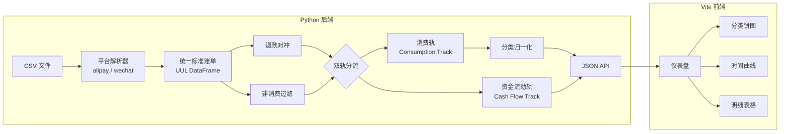
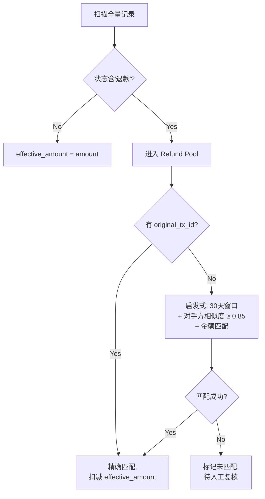

# 跨平台支付数据记账分析工具实施方案（V2）

基于两份参考文档（[02-22版](file:///Users/park0er/Coding/PersonalMatters/Financial/SpendingAnalyser/参考材料/2026-02-22_支付记录导出与分析指南.md) / [02-23版](file:///Users/park0er/Coding/PersonalMatters/Financial/SpendingAnalyser/参考材料/2026-02-23_支付记录导出与分析指南.md)）与用户反馈，更新后的方案如下。

---

## 范围与分期

| 版本 | 平台 | 核心能力 |
|---|---|---|
| **V1 (MVP)** | 支付宝 + 微信 | 解析 → 清洗 → 分类 → Web UI 可视化报告 |
| **V2** | + 抖音/京东/美团 | 非消费资金池分析、月环比异动检测 |

---

## 架构概览

技术栈：**Python 后端**（pandas 做数据处理）+ **Vite 前端**（用 Chart.js 做可视化）



---

## 双轨制数据架构

> [!IMPORTANT]
> 所有被过滤掉的非消费项（红包、转账、理财等）**不丢弃**，存入 **Cash Flow Track**，为 V2 的资金池分析预留数据。

| 轨道 | 内容 | V1 用途 | V2 用途 |
|---|---|---|---|
| **消费轨** | 退款对冲后的真实消费 | 分类可视化、趋势分析 | + 异动检测 |
| **资金流动轨** | 红包/转账/充值/理财 | 仅存储，页面展示总额 | 深度分析资金流向 |

---

## Proposed Changes

### 后端 Python 模块

#### [NEW] [base.py](file:///Users/park0er/Coding/PersonalMatters/Financial/SpendingAnalyser/src/parsers/base.py) — UUL 数据模型

统一标准账单 DataFrame Schema。各 parser 输出相同结构：

| 字段 | 类型 | 说明 |
|---|---|---|
| `source_platform` | str | alipay / wechat |
| `transaction_id` | str | 原始交易单号 |
| `timestamp` | datetime | UTC+8 |
| `direction` | str | 收入/支出 |
| `amount` | float | 正数金额 |
| `counterparty` | str | 交易对手方 |
| `description` | str | 商品/订单描述 |
| `payment_method` | str | 支付渠道 |
| `status` | str | 成功/退款/撤销 |
| `platform_category` | str | 平台预设分类 |
| `original_tx_id` | str | 退款关联原始单号 |
| `is_consumption` | bool | 真实消费 vs 资产转移 |
| `effective_amount` | float | 对冲后实际金额 |
| `global_category_l1` | str | 全局一级分类 |
| `global_category_l2` | str | 全局二级分类 |
| `track` | str | consumption / cashflow |

---

#### [NEW] [alipay.py](file:///Users/park0er/Coding/PersonalMatters/Financial/SpendingAnalyser/src/parsers/alipay.py) / [wechat.py](file:///Users/park0er/Coding/PersonalMatters/Financial/SpendingAnalyser/src/parsers/wechat.py) — 平台解析器

- 自动检测编码（UTF-8 BOM / GBK / GB2312）
- 跳过文件头部元数据行，定位实际表头
- 字段映射到 UUL Schema
- 支付宝：利用 `originalTransactionId` 做退款精确关联
- 微信：解析收/支状态、交易类型（商户消费/转账/红包等）

---

#### [NEW] [refund_netting.py](file:///Users/park0er/Coding/PersonalMatters/Financial/SpendingAnalyser/src/cleaners/refund_netting.py) — 退款对冲



---

#### [NEW] [non_consumption.py](file:///Users/park0er/Coding/PersonalMatters/Financial/SpendingAnalyser/src/cleaners/non_consumption.py) — 非消费过滤

关键词黑名单硬过滤 + 对手方特征软过滤。过滤后的记录 `track = 'cashflow'`，**保留完整数据**不丢弃。

---

#### [NEW] [taxonomy.py](file:///Users/park0er/Coding/PersonalMatters/Financial/SpendingAnalyser/src/classifiers/taxonomy.py) — 分类映射

平台预设标签 → 全局二级分类。兜底：description 关键词匹配。

---

#### [NEW] [api.py](file:///Users/park0er/Coding/PersonalMatters/Financial/SpendingAnalyser/src/api.py) — JSON API 服务

使用 Flask/FastAPI 提供 REST 接口给前端调用：
- `GET /api/summary` — 总览数据（总支出/收入/净消费）
- `GET /api/by-category` — 按分类聚合
- `GET /api/by-period?granularity=month` — 按周/月/年聚合时间序列
- `GET /api/top-merchants` — Top 商户排名
- `GET /api/cashflow-summary` — 资金流动轨总览（V1 简版）
- `GET /api/transactions` — 明细列表，支持翻页/筛选

---

### 前端 Vite 应用

#### [NEW] [frontend/](file:///Users/park0er/Coding/PersonalMatters/Financial/SpendingAnalyser/frontend/)

使用 Vite + 原生 JS + Chart.js 构建，**不引入 React/Vue**（保持轻量）。

页面布局：
1. **总览卡片区**：总支出、净消费、退款金额、非消费转移金额
2. **分类饼图**：交互式饼图，点击可下钻到二级分类
3. **时间趋势图**：折线/柱状图，支持切换年/月/周粒度
4. **Top 商户排名**：横向柱状图
5. **明细表格**：可排序、可搜索、可按平台/分类/时间筛选
6. **资金流动面板**（V1 简版）: 仅展示总额与大类占比

---

## 项目目录结构

```
SpendingAnalyser/
├── 参考材料/
├── data/                     # 用户放 CSV（gitignore）
├── src/
│   ├── parsers/
│   │   ├── base.py           # UUL Schema
│   │   ├── alipay.py
│   │   └── wechat.py
│   ├── cleaners/
│   │   ├── refund_netting.py
│   │   └── non_consumption.py
│   ├── classifiers/
│   │   └── taxonomy.py
│   ├── api.py                # REST API
│   └── main.py               # 入口
├── frontend/                 # Vite 前端
│   ├── index.html
│   ├── src/
│   │   ├── main.js
│   │   ├── api.js
│   │   ├── charts.js
│   │   └── style.css
│   ├── package.json
│   └── vite.config.js
├── tests/
├── requirements.txt
└── .gitignore
```

---

## Verification Plan

### Automated Tests
```bash
python -m pytest tests/ -v
```
覆盖：Parser 正确性、退款对冲（精确+启发式+部分退款）、非消费过滤

### Manual Verification
1. 用户提供真实 CSV → 运行后端 → 检查 API 返回数据
2. 打开 Web UI → 目视检查图表与明细是否合理
3. 重点人工核对退款对冲与非消费过滤的准确性
